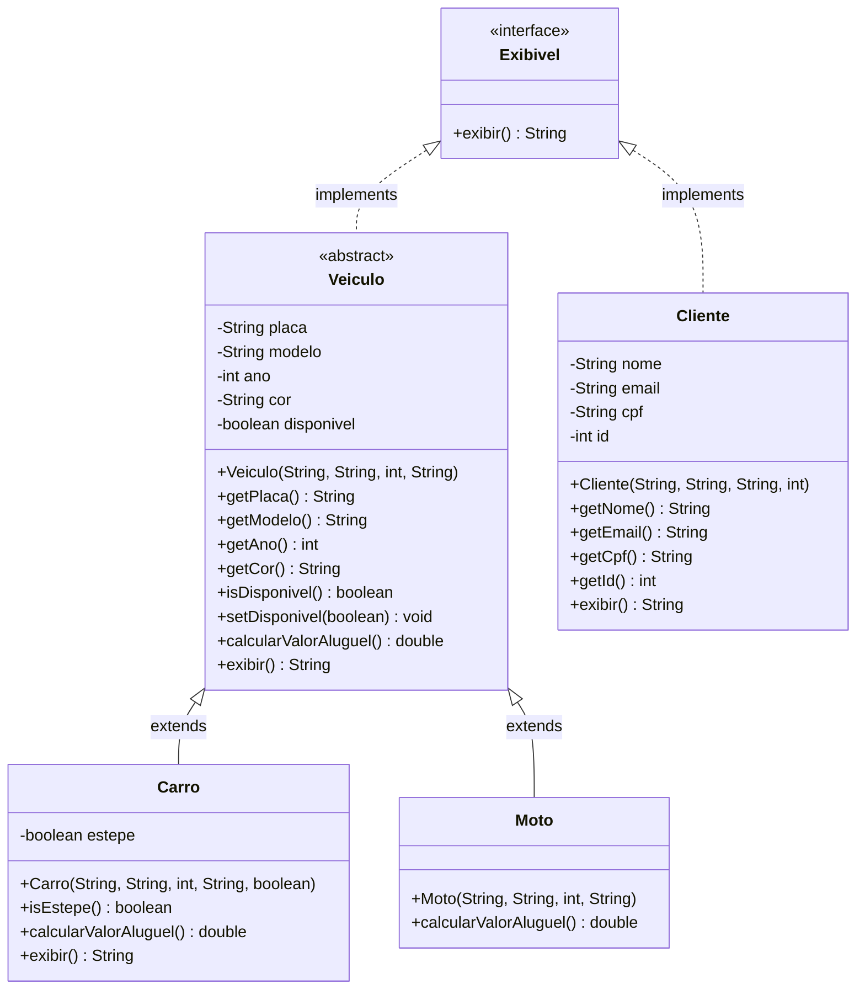

# 🚗 Vehicle Rental System

> A Java console application that simulates a vehicle rental workflow, architected around clean OOP principles — abstract classes, polymorphism, interfaces, encapsulation, and inheritance working together as they should.

[](https://www.oracle.com/java/)
[]()
[](LICENSE)
[]()

---

## 📋 Table of Contents

- [Overview](#overview)
- [Architecture](#architecture)
- [Key Design Decisions](#key-design-decisions)
- [Features](#features)
- [Project Structure](#project-structure)
- [Prerequisites](#prerequisites)
- [Getting Started](#getting-started)
- [Usage](#usage)
- [OOP Concepts Demonstrated](#oop-concepts-demonstrated)
- [Team](#team)
- [Academic Context](#academic-context)
- [License](#license)

---

## Overview

**Vehicle Rental System** is a CLI-driven Java application simulating the end-to-end workflow of a rental agency. A customer browses available vehicles through an interactive menu, submits documentation, and receives an agency pickup location upon confirmation.

The project's primary objective is **modeling fidelity over feature breadth**: every design decision reflects how entities actually behave in the real world. A `Moto` not having a spare tire is not a workaround — it is a design constraint that naturally drives the class hierarchy. This is what good OOP looks like.

---

## Architecture

The system is organized around a deliberate three-layer structure:

```
Exibivel (interface)
│   └── Contract: "I can present my own data as text"
│
├── Veiculo (abstract class)  implements Exibivel
│   │   Common state  : placa, modelo, ano, cor, disponivel
│   │   Mandated behavior : calcularValorAluguel() — abstract, each subtype defines its own
│   │   Base behavior     : exibir() — shared display logic for common fields
│   │
│   ├── Carro extends Veiculo
│   │       Adds       : estepe
│   │       Defines    : calcularValorAluguel() — car pricing (base rate + insurance)
│   │       Extends    : exibir() — super() + estepe details
│   │
│   └── Moto extends Veiculo
│           Defines    : calcularValorAluguel() — motorcycle pricing (base rate + equipment fee)
│           Inherits   : exibir() — no override needed; common fields are sufficient
│
└── Cliente  implements Exibivel
        State   : nome, email, cpf, id
        Defines : exibir() — customer-specific display
```

### Class Diagram



---

## Key Design Decisions

### 1. `Veiculo` is Abstract — Because a Generic Vehicle Does Not Exist

No customer ever rents a "vehicle". They rent a Honda Civic or a Honda CB500. Allowing `new Veiculo(...)` would be semantically incorrect. Declaring the class `abstract` enforces this at the compiler level: only concrete subtypes can be instantiated. The type exists solely to define the shared contract and state for its children.

### 2. `calcularValorAluguel()` is an Abstract Method — Pricing is Type-Specific

Car rentals include a mandatory insurance fee. Motorcycle rentals include an equipment fee. The rule differs per type, so no single implementation in `Veiculo` could be correct for both. Declaring the method `abstract` mandates that every vehicle type provides its own pricing logic, while the calling code can invoke `veiculo.calcularValorAluguel()` polymorphically — without caring which type it holds at runtime. This is the **Open/Closed Principle** in practice: the system is open for extension (add `Van`, `Truck`) without modifying existing logic.

### 3. `estepe` Lives in `Carro`, Not in `Veiculo`

A motorcycle does not have a spare tire. Placing `estepe` in the parent class would force `Moto` to either inherit a meaningless attribute or override it to signal "not applicable" — a textbook **refused bequest** smell and a violation of the **Liskov Substitution Principle**. Attributes only flow downward in a healthy hierarchy: the parent holds only what is universally true, and each child adds what is exclusively its own.

### 4. `cor` Lives in `Veiculo`, Not in the Subclasses

Both cars and motorcycles have a color, and the system actively uses it for display and identification. Attributes that are shared and used identically across all subtypes belong in the parent — duplicating them in `Carro` and `Moto` would be a YAGNI violation and would make future attribute changes a multi-file problem.

### 5. `Exibivel` is an Interface, Not a Reliance on `toString()`

`Veiculo` and `Cliente` share no inheritance relationship, yet the rental system must display both in a unified way — in the menu, in booking confirmations, in receipts. The `Exibivel` interface creates an **explicit, intentional contract** that is scoped to this domain. Unlike `toString()`, which every Java object inherits silently by default, `Exibivel` communicates semantic intent: *"these specific classes were deliberately designed to be displayed in this system."* Code that accepts `Exibivel` is more expressive and type-safe than code that accepts `Object` and calls `toString()`.

### 6. The Menu is Driven by a `while` Loop, Not `do-while`

A `do-while` executes the body before checking the exit condition — semantically, it assumes something should always happen at least once. A `while` with a boolean control variable (`boolean rodando = true`) is explicit about the loop's precondition and makes the exit logic visible at the point of declaration. Prefer clarity over brevity.

---

## Features

- **Interactive CLI menu** — `while`-driven interface with clean, explicit exit handling
- **Real-time availability filtering** — only `disponivel == true` vehicles are listed to the customer
- **Polymorphic rental pricing** — `calcularValorAluguel()` returns the correct value per vehicle type without conditional branching in the calling code
- **Document & license verification** — validates submitted documentation before confirming the rental
- **Unified display contract** — `Veiculo` (and its subtypes) and `Cliente` implement `Exibivel`, enabling uniform display across unrelated types
- **Agency pickup location** — system returns the pickup agency location upon rental confirmation

---

## Project Structure

```
vehicle-rental-system/
├── src/
│   └── main/
│       └── java/
│           └── com/
│               └── locadora/
│                   ├── contracts/
│                   │   └── Exibivel.java           # Display interface
│                   ├── models/
│                   │   ├── Veiculo.java             # Abstract base class
│                   │   ├── Carro.java               # Concrete: car
│                   │   ├── Moto.java                # Concrete: motorcycle
│                   │   └── Cliente.java             # Customer entity
│                   ├── service/
│                   │   └── AluguelService.java      # Rental workflow orchestration
│                   └── Main.java                    # Entry point & menu loop
├── .gitignore
├── README.md
└── pom.xml                                          # Maven build descriptor (optional)
```

---

## Prerequisites

| Tool | Version |
|------|---------|
| JDK | 17 or higher |
| Maven *(optional)* | 3.6 or higher |
| Git | Any |

---

## Getting Started

### Clone the repository

```bash
git clone https://github.com/<your-username>/vehicle-rental-system.git
cd vehicle-rental-system
```

### Compile and run (plain `javac`)

```bash
# Compile all sources
find src -name "*.java" | xargs javac -d out

# Run
java -cp out com.locadora.Main
```

### Compile and run (Maven)

```bash
mvn compile exec:java -Dexec.mainClass="com.locadora.Main"
```

---

## Usage

```
============================================
        VEHICLE RENTAL SYSTEM
============================================
Available vehicles:

[1] Honda Civic   | Silver | Plate: ABC-1234 | Spare tire: Yes
[2] Honda CB500   | Black  | Plate: XYZ-5678

[0] Exit

Select a vehicle: 1

──────────────────────────────────────────
Vehicle selected: Honda Civic | Silver | ABC-1234
Rental price: R$ 150.00 (daily) + R$ 30.00 (insurance) = R$ 180.00/day

Number of days: 3
Total: R$ 540.00
──────────────────────────────────────────

Please submit your documents (Category B driver's license required):
> Submitted.

Documents verified. ✓
Vehicle status: Unavailable (reserved for you)

──────────────────────────────────────────
Pickup location:
  Locadora Central
  Av. Paulista, 1000 — São Paulo, SP
  Business hours: Mon–Fri 08h–20h | Sat 09h–15h

Rental confirmed. See you at the agency!
============================================
```

---

## OOP Concepts Demonstrated

| Concept | Where Applied | What It Enforces |
|---|---|---|
| **Abstract Class** | `Veiculo` | No direct instantiation; defines the common contract for all vehicles |
| **Inheritance** | `Carro`, `Moto` extend `Veiculo` | Shared state and behavior flow down; subtypes add only what is their own |
| **Polymorphism** | `calcularValorAluguel()` | Same method call, different pricing logic per concrete type — no `instanceof` needed |
| **Interface** | `Exibivel` on `Veiculo` and `Cliente` | Explicit, intentional display contract across unrelated type hierarchies |
| **Encapsulation** | All fields `private` in every class | State is controlled; external access only through getters/setters |
| **Constructor** | All classes | Every object is born in a valid, complete state |
| **`@Override`** | Concrete method implementations | Compiler-validated fulfillment of abstract and interface contracts |
| **`super`** | `Carro.exibir()` | Extends parent behavior without duplicating base logic |

---

## Team

| Role | Scope |
|---|---|
| **Arquiteto / Integrador** | `Veiculo` (abstract class) · `Exibivel` (interface) · codebase integration · Git |
| **Dev Carro** | `Carro` — attributes, `calcularValorAluguel()`, `exibir()` override |
| **Dev Moto** | `Moto` — `calcularValorAluguel()` |
| **Dev Cliente + Validação** | `Cliente` — attributes, `exibir()` · document and license verification logic |
| **Dev Fluxo / Main** | `while` menu loop · rental workflow · `Main.java` |

---

## Academic Context

This project was developed as part of the **Object-Oriented Programming** discipline at [Senac-SP](https://www.sp.senac.br/) — Systems Analysis and Development (ADS) program.

Concepts evaluated: abstract classes, inheritance, polymorphism, interfaces, encapsulation, and constructors.

**Delivery:** June 14, 2026.

---

## License

Distributed under the MIT License. See [`LICENSE`](LICENSE) for more information.

---

<p align="center">
  Built with ☕ Java — because the JVM never lies.
</p>
